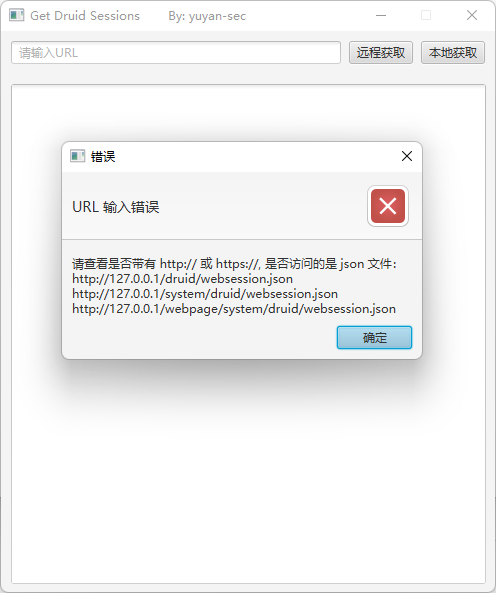

### 使用说明：

利用工具快速获取 Alibaba Druid 的相关参数（sessions, sql, uri, jdbc ），然后就可以利用Burpsuite进行遍历sessions验证是否可用，如果运气好就可以利用session进入后台或者getshell 啦。

### 利用实例

cwkiller师傅的利用文章：https://www.cnblogs.com/cwkiller/p/12483223.html

从druid未授权到getshell：https://xz.aliyun.com/t/10110

### 工具说明：

使用了 swing , 应该支持所有 jdk 了

默认请求带有 /druid/* 相关路径

GUI 界面参考：https://github.com/f0ng/poc2jar

----

#### 仅供学习交流，切勿用于非法用途，否则一切后果自负！
